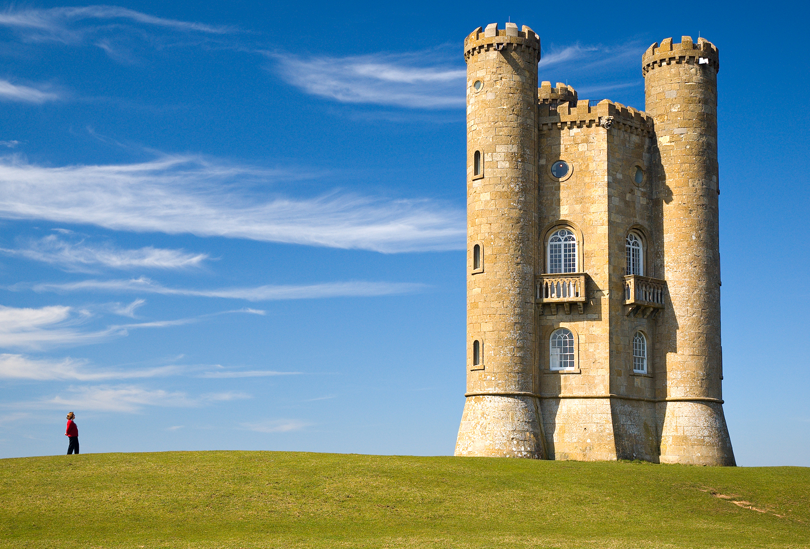
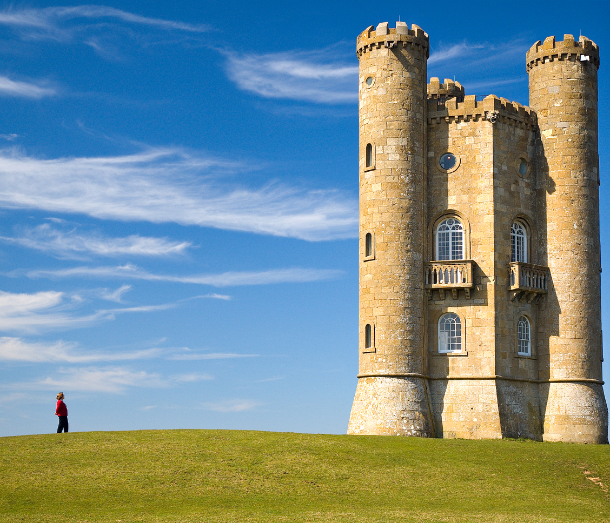
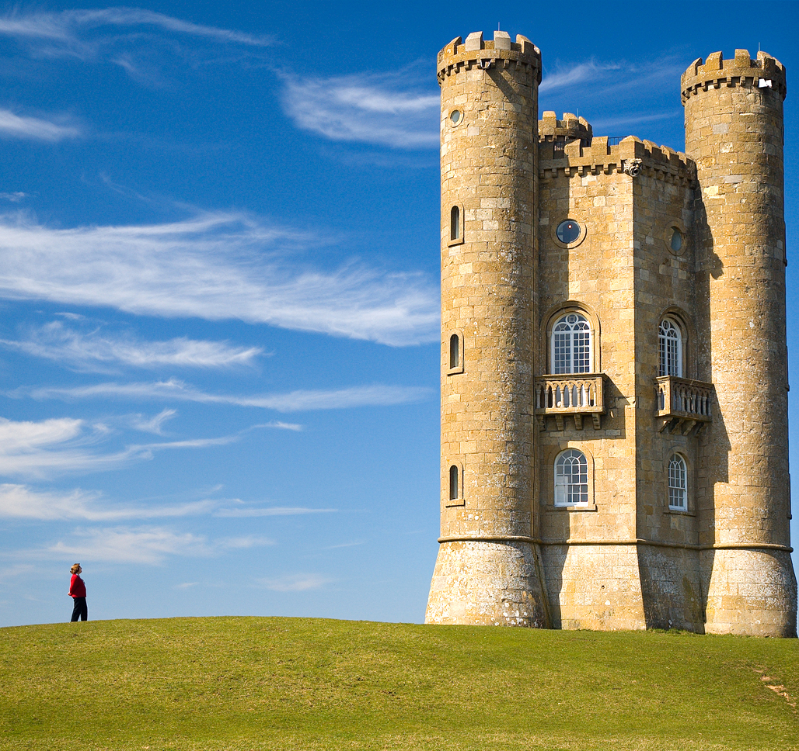
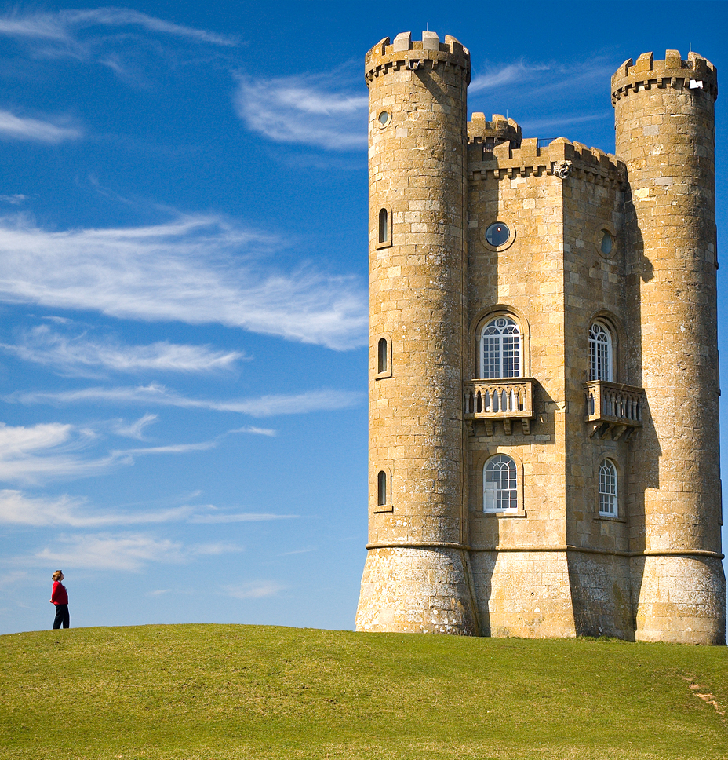

# seam-carving

> An implementation of the seam carving algorithm to rescale images.
>
> This implementation uses the stb headers for image I/O

## Quick start

```console
$ cc -o nob nob.c
$ ./nob.h ./images/test_0.jpg ./images/output.png
```

## Example Images

<table>
    <thead>
        <tr>
            <th>Original Image</th>
            <th>After removing 50px from width</th>
            <th>After removing 100px from width</th>
            <th>After removing 200px from width</th>
        </tr>
    </thead>
    <tr>
        <td max-width="25%" height="120px"></td>
        <td max-width="25%" height="120px"></td>
        <td max-width="25%" height="120px"></td>
        <td max-width="25%" height="120px"></td>
    <tr>
    <tr>
        <td max-width="25%" height="120px"></td>
        <td max-width="25%" height="120px"></td>
        <td max-width="25%" height="120px"></td>
        <td max-width="25%" height="120px"></td>
    <tr>
    <tr>
        <td max-width="20%" height="120px"></td>
        <td max-width="20%" height="120px"></td>
        <td max-width="20%" height="120px"></td>
        <td max-width="20%" height="120px"></td>
    <tr>
    <tbody>
    </tbody>
</table>

## References

- <https://stackoverflow.com/questions/596216/formula-to-determine-perceived-brightness-of-rgb-color>
- <https://en.wikipedia.org/wiki/Seam_carving>
- <https://dl.acm.org/doi/10.1145/1276377.1276390>
- <https://github.com/nothings/stb>
